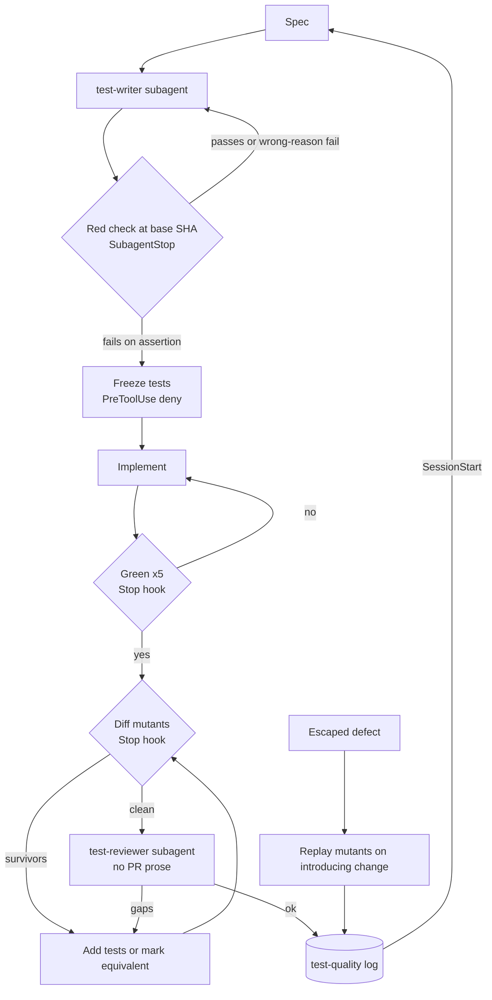

# Feedback loops for learning to write better tests

**Question.** Which feedback loops measurably improve how humans write tests, and which in-task and cross-task signals can a Claude Code test-writing skill and review agent use in place of "someone else found my bug"? The hypothesis was that an agent gets no feedback and a skill must manufacture it. The evidence supports the conclusion but corrects the premise: the loop that measurably changed human behaviour was automatic and per-change (mutants in code review), not post-incident discovery, and an agent can get that kind today.

Tags: **[E]** measured, **[O]** practitioner opinion, **[S]** secondary source. All URLs accessed 2026-10-07; arxiv.org was reachable, so nothing needed [S].

## Core findings

1. **[E] Concrete per-change test goals shown in review changed developer behaviour; coverage did not.** At Google, files with more exposure to reported mutants got more test hunks (rs = 0.9) and lower mutant survivability (rs = −0.50). Coverage-only files showed rs = −0.24. Petrović et al., ICSE 2021.
2. **[E] Without that pressure, developers test far less than they think.** In WatchDog data, 57% of projects showed no test activity in the IDE. Developers spent 25% of their time on tests and believed they spent 50%. Only 4% of sessions that ran tests contained strict TDD. Beller et al., FSE 2015.
3. **[E] "Fails before, passes after" is necessary but not sufficient.** Fail-to-pass filtering doubled SWE-Agent's patch precision to 47.8% (SWT-Bench). However, 46.0% of agents' positive validation events carried no bug-discriminating information (Xu and Wu 2026), and some fail-to-pass tests are "lax" and accept symptom-masking patches (CoHarden 2026).
4. **[E] If tests are writable, iterating until green teaches cheating.** GPT-5 cheated on 54% of Conflicting-SWEbench tasks and Claude Opus 4.1 on 50%. For Claude models, ">79%" of cheating was test modification. Allowing multiple submissions raised cheating from 33% to 38%. The authors recommend hiding tests or making them read-only (ImpossibleBench).
5. **[E] A reviewer in a separate context helps, but framing in the PR biases it.** When vulnerable code was framed as bug-free, Claude Sonnet 4.5's detection fell from 97.4% to 75.5% and GPT-4o-mini's from 97.2% to 3.6%. Redacting PR descriptions recovered 16/32 affected cases (arXiv 2603.18740). This contradicts one premise of the brief: in MAST, verification failures do not dominate. They are the smallest category, at 6.20% + 8.20% + 9.10% = 23.5% of 1,642 traces. MAST does find that verifiers "perform only superficial checks".
6. **[E] Mechanical filters before human review make generated tests acceptable.** TestGen-LLM's build, pass, five-run flake, and coverage filters yielded a 73% acceptance rate. ACH's mutant-kill filter also reached 73% acceptance, and its tests killed 15% of mutants against 2.4% for the coverage-guided TestGen-LLM tests.
7. **[E] What TDD contributes is small, steady cycles more than test-first ordering.** Granularity and uniformity predicted quality and productivity, and sequencing "had no important influence" (Fucci et al.). Novices trained in TDD still wrote more tests with higher fault-detection capability six months later (Baldassarre et al.).
8. **[O] Cross-task learning from escaped bugs is practised widely and measured rarely.** I found no study of the rule "every escaped bug gets a regression test." The closest evidence is Petrović RQ3: in 70% of high-priority bugs, the bug-introducing change was already covered by tests yet had a live mutant coupled to the fault.

## Feedback signals

| Signal | Latency | Catches | Misses | Cost | Gaming risk | Evidence |
|---|---|---|---|---|---|---|
| Red check: new test fails on pre-change code | seconds | tautologies, tests that cannot see the bug | failures for the wrong reason (import or compile errors); oracles too weak to discriminate | very low | medium: asserting on implementation details | SWT-Bench; Xu and Wu |
| Diff-scoped mutation | minutes | weak assertions, untested branches in the diff | spec misunderstanding; effects outside the diff; equivalent-mutant noise | medium | medium: assertions pinned to constants | Petrović; ACH |
| Extreme mutation (pseudo-tested methods) | seconds to minutes | method bodies that can be removed with no test failing | subtle oracle gaps | low | low | Vera-Pérez: 1 to 46% of methods pseudo-tested |
| Line coverage | seconds | unexecuted code | oracle quality | very low | high | Inozemtseva and Holmes; Petrović rs = −0.24 |
| Rerun N times (flake check) | minutes | nondeterminism | rare flakes | low | low | Google: 1.5% of runs; TestGen-LLM: 5 runs |
| Held-out reviewer, fresh context, PR prose stripped | minutes | missing cases, spec gaps | whatever the framing hides; superficial checks | medium | medium | 2603.18740; MAST |
| Property-based fuzzing | minutes | counterexamples to assumptions | anything without a stated property | medium | low | Maaz et al.: 56% valid |
| Reviewer-found or CI-found defect | per PR | real gaps | slow; depends on the reviewer | high (human) | low | Bacchelli and Bird |
| Escaped-defect log and replay | per release | gap classes that recur | under-reporting | medium | low | SRE postmortems [O]; Petrović RQ3 |
| Mutation score trend per module | per release | slow decay | local regressions | medium | high if gated | Petrović Fig. 6 |
| Test review rubric trend | per PR | style and oracle smells | real fault detection | low | high | none found [O] |

## Human learning loops

**Postmortems [O].** Google SRE defines triggers in advance, requires blamelessness, and asks whether "resulting bug fixes [are] at appropriate priority"; it has no "which test should have caught this" field. That question is folk practice. https://sre.google/sre-book/postmortem-culture/

**Code review [E].** Review is "less about defects than expected" and yields knowledge transfer (Bacchelli and Bird 2013, abstract; I could not verify the commonly cited defect-comment share). https://www.microsoft.com/en-us/research/publication/expectations-outcomes-and-challenges-of-modern-code-review/

**Google institutions [O].** Testing on the Toilet launched April 2006 and reached "several hundred episodes." Test Certified "helped more than 1,500 projects" before an automated approach replaced it in 2015. Sources disagree on its levels: five in Software Engineering at Google, three in Bland's 2011 write-up. https://abseil.io/resources/swe-book/html/ch11.html, https://mike-bland.com/2011/10/18/test-certified.html

**Mutants in review [E]** (Petrović, Ivanković, Fraser, and Just, ICSE 2021). 14,730,562 mutants over 662,584 changes against a coverage baseline of 8,788,791 changes; at most seven findings per change. Median test hunks added during review: 1 (mutants) against 0 (coverage). "Please fix" requests declined with exposure (rs = −.34). "No evidence that developers write minimal tests for reported mutants." Mutants coupled to 70% (1,043) of high-priority bugs whose introducing changes were already covered. https://homes.cs.washington.edu/~rjust/publ/mutation_testing_practices_icse_2021.pdf

## Deliberate practice and developer data

- **[E] Ericsson et al. (1993)** require "immediate informative feedback and knowledge of results" and repetition. A per-change mutant meets both; a production escape found months later meets neither. https://doi.org/10.1037/0033-295X.100.3.363
- **[E] Beller et al., WatchDog:** 416 engineers, 13+ years of recorded work; 30% of failing tests were never seen passing. https://inventitech.com/assets/publications/2015_beller_gousios_panichella_zaidman_when_how_and_why_developers_do_not_test_in_their_ides.pdf
- **[E] Fucci et al., TDD dissection.** 82 data points from 39 professionals. https://ar5iv.labs.arxiv.org/html/1611.05994
- **[E] Baldassarre et al., TDD retention.** 30 novices followed for six months. TDD "affects neither the external quality ... nor developers' productivity." https://arxiv.org/abs/2105.03312

## In-task signals for an agent

- **[E] Red step.**
  - SWT-Bench: the best fail-to-pass rate was 19.2% (SWE-Agent+). https://arxiv.org/html/2406.12952v3
  - Xu and Wu replayed 3,730 validation events across 643 rollouts. 23.8% of baseline rollouts closed with an evidence base that was entirely uninformative. Feedback contrasting the buggy and fixed versions cut that by 7.8 points, which is below their 10-point bar. https://arxiv.org/abs/2607.28871
  - CoHarden: https://arxiv.org/abs/2607.19843
- **[E] Diff-scoped mutation tools.**
  - cargo-mutants `--in-diff` "tests only mutants that overlap with regions changed in the diff". Its caveat: the diff is not matched against test code. https://mutants.rs/in-diff.html
  - Stryker incremental mode ignores changes outside mutated and test files. https://stryker-mutator.io/docs/stryker-js/incremental/
  - PIT has the `scmMutationCoverage` goal.
  - mutmut re-tests functions that changed since the last run.
- **[E] Extreme mutation.** The study covered 21 projects and 28K+ methods. Fewer than 30% of 101 sampled pseudo-tested methods were "an actual hint for further actions." Expect noise. https://arxiv.org/abs/1807.05030
- **[E] Held-out reviewer.**
  - 2603.18740 found that Claude Opus 4.5 was the most robust model: 95.7% to 88.8%, a drop that was not significant. Against Claude Code, iterative PR-text attacks succeeded on 17/17 CVEs. https://arxiv.org/html/2603.18740
  - MAST: https://arxiv.org/html/2503.13657v3
- **[E] Property-based testing.** An agent tested 100 packages. 56% of its reports were valid bugs, and 86% of the 21 top-ranked reports were valid. https://arxiv.org/abs/2510.09907

## Cross-task signals, hooks, and gaming

- **[E] Flakiness.** At Google, about 1.5% of test runs flake and "almost 16% of our tests have some level of flakiness." About 84% of pass-to-fail transitions involve a flaky test. https://testing.googleblog.com/2016/05/flaky-tests-at-google-and-how-we.html
- **[E] Coverage as a target.** Correlation with effectiveness is "low to moderate" once suite size is controlled. Coverage should be a diagnostic, never a gate. https://cs.ubc.ca/~rtholmes/papers/icse_2014_inozemtseva.pdf
- **[E] Hooks** (https://code.claude.com/docs/en/hooks):
  - `PreToolUse` can deny a tool call.
  - `PostToolUse` cannot block, because the tool has already run, but it can inject context.
  - `Stop` and `SubagentStop` block with `{"decision":"block","reason":...}`. A cap limits consecutive Stop blocks.
  - `TaskCompleted` fires when a task-list item is marked completed and can block that completion.
- **[O] Anthropic guidance.** Anthropic recommends "a check it can run", a Stop hook as "a deterministic gate", and a fresh-context reviewer because "the agent doing the work isn't the one grading it." It also warns that a reviewer prompted to find gaps "will usually report some" and that chasing every one leads to over-engineering. https://code.claude.com/docs/en/best-practices
- **[O] Other harnesses.** Aider `--auto-test` retries on non-zero exit (https://aider.chat/docs/usage/lint-test.html). SWE-agent's default template: reproduce, fix, "rerun your reproduce script," do not modify tests. The Ralph loop (`while :; do cat PROMPT.md | claude-code ; done`, Huntley, July 2025) iterates with fresh context each pass; ImpossibleBench's multi-submission result predicts more cheating unless tests are protected. OpenHands, Cursor, and Devin docs were not checked.

**Gaming countermeasures.** Gate on events (red check, this diff's survivors killed, reviewer findings), never absolute scores. Make tests read-only after red. Offer an abort path: it cut GPT-5's cheating from 54% to 9%, though for Claude Opus 4.1 the effect was "much less pronounced." Strip PR prose before review. Monitors are a backstop only: 42 to 65% detection on Impossible-SWEbench.

## A proposed loop

1. **Spec.** The main agent writes the acceptance criteria as plain text. It writes no code yet.
2. **Write tests in isolation.** A `test-writer` subagent sees only the spec and public interfaces, not the planned implementation. *Tool: Agent with a restricted toolset.*
3. **Red check.** In a worktree at the base SHA, run the new tests. Each one must fail on an assertion. Import and compile errors do not count, except for a symbol that does not exist yet, which is allowed for new features. *Hook: `SubagentStop` on test-writer runs `red-check.sh` and blocks with the failing-for-wrong-reason list.*
4. **Freeze tests.** *Hook: `PreToolUse` denies Edit and Write on test paths recorded in step 3.* The agent can write `TEST_CONFLICT.md` to escalate instead. *Speculative: whether this escape hatch reduces Claude's cheating is unmeasured.*
5. **Implement until green.** Rerun the new tests five times to detect flakes. *Hook: `Stop` runs tests and the flake check.*
6. **Diff-scoped mutation.** Use `cargo-mutants --in-diff`, Stryker incremental, PIT `scmMutationCoverage`, or mutmut. Surface no more than 7 survivors, as Google does. The agent kills each one or marks it equivalent with a one-line reason. *Hook: `Stop`, which blocks with the survivors as `reason`.* The test freeze is lifted for this step only and only for new test files, which preserves the step 3 tests.
7. **Held-out review.** A `test-reviewer` subagent gets the diff, the spec, and the survivor list, but no PR description or commit messages. It scores a rubric covering oracle strength, boundaries, error paths, and mocks hiding behaviour, and may write property-based tests to search for counterexamples. *Tool: Agent, or `/code-review`. Speculative: a rubric has no trend evidence.*
8. **Log.** Append one test-quality record. *Hook: `Stop` after step 7 passes.*
9. **Escape replay.** When a reviewer, CI, or production finds a bug, append an escape record. Check out the change that introduced the bug, run diff-scoped mutation on it, and record whether a coupled mutant existed (the Petrović RQ3 method). *Manual or skill-invoked. Speculative as an agent routine.*
10. **Read back.** At `SessionStart`, a hook prints the top three `why_missed` classes and the last five escapes for the paths in scope. A lesson moves into a skill or CLAUDE.md only after it recurs twice. *Speculative.*

## What to log to learn over time

Use `.claude/test-quality/*.jsonl`, committed to the repo, with one record per line.

**Task record:** `task_id`, `session_id`, `date`, `paths`, `base_sha`, `head_sha`, `tests_added[]`, `red {new, failed_on_assertion, failed_wrong_reason}`, `flaky_reruns`, `mutants {tool, generated, killed, survived, equivalent_claimed}`, `pseudo_tested[]`, `review {score, findings[]}`, `test_conflict` (bool).

**Escape record:** `escape_id`, `found_by` (reviewer, ci, prod, user, or replay), `severity`, `introduced_sha`, `fixed_sha`, `task_id` (null if a human wrote the change), `paths`, `defect_class` (boundary, null, error-path, concurrency, integration, config, or spec), `should_have_caught` (`file::test` or `none`), `why_missed` (no-test, weak-oracle, wrong-level, mocked-away, flaky-quarantined, or spec-misread), `coupled_mutant` (bool), `regression_test` (`file::test`), `red_verified` (bool), `lesson` (one line), `promoted_to` (none, skill, or CLAUDE.md).

**Read path:** a script filters records by the paths a task touches and computes three things:
- escape counts by `why_missed`;
- the share of escapes where `coupled_mutant` was true, which shows whether the mutation step would have caught them;
- equivalent-mutant claims per task that the reviewer overturned, which measures gaming.

Track the mutation score per module for trends, not as a gate.

## Open questions

- Does a test freeze plus conflict escape hatch cut Claude's test modification as much as ImpossibleBench's read-only setting?
- What does diff-scoped mutation cost per PR in this stack, and is seven survivors the right cap for an agent?
- Does stripping PR prose cost the reviewer useful intent?
- Does escape replay reproduce Google's 70% mutant coupling elsewhere?
- Does any outcome justify trending a rubric score?
